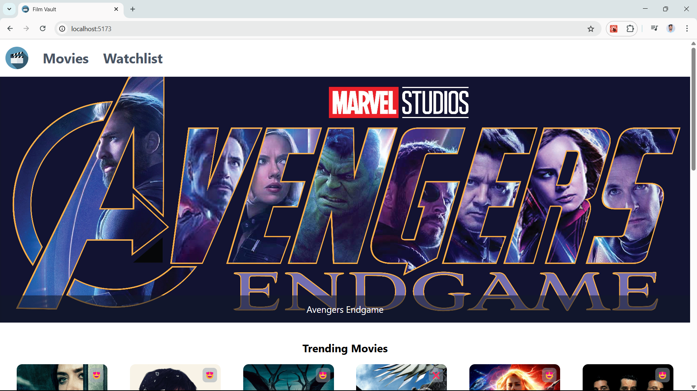
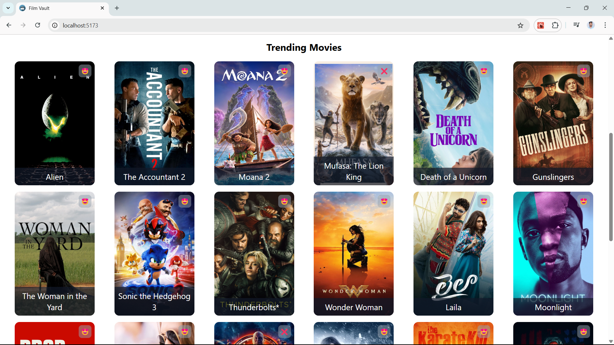
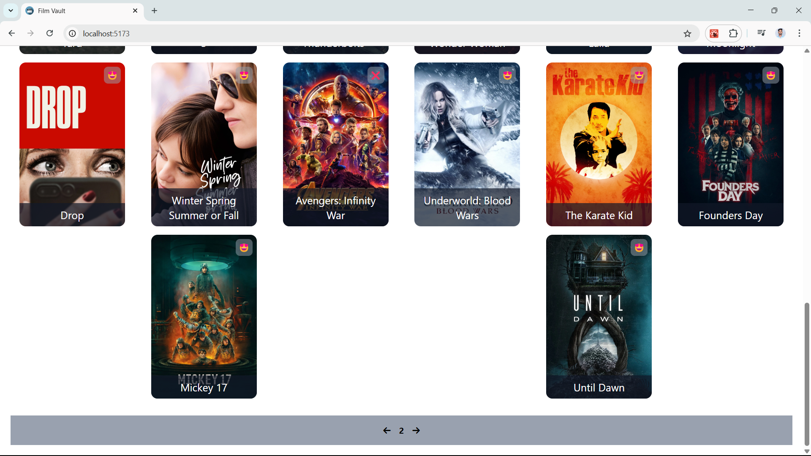
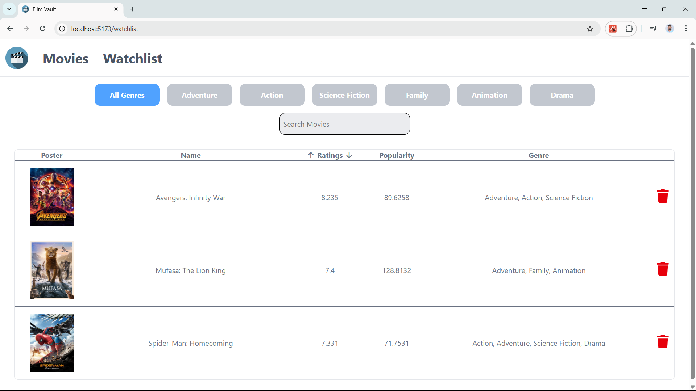

# 🎬 Film Vault

**Film Vault** is a dynamic React-based movie watchlist application built with **Vite + React** that integrates with [TMDB (The Movie Database)](https://www.themoviedb.org/) to fetch trending movies. Users can browse popular movies, filter by genre, search by title, sort by ratings, and manage a personalized watchlist with local storage.

---

## 🚀 Features

- 🔍 **Search Movies** by title
- 🎭 **Filter by Genre** dynamically
- ⭐ **Sort Movies by Rating** (ascending & descending)
- ➕ **Add or Remove** movies from your watchlist
- 💾 **Persist Watchlist** using localStorage
- 🌐 **Pagination** with TMDB data
- 🖼️ **TMDB Posters** with API integration
- 🧭 **Routing** via React Router
- 🎨 UI styling with TailwindCSS and icons

---

## 🔗 Live API Integration

This app uses the [TMDB API](https://developer.themoviedb.org/reference/movie-popular-list) to fetch popular movies dynamically:

### GET https://api.themoviedb.org/3/movie/popular

- API Key: Secured (used for development)
- Data: Title, Poster, Genre IDs, Ratings, Popularity
- Pagination: Supported (user can browse through pages)

---

## 📁 Project Structure

```
film-vault/
    ├── src/
    │
    ├── components/
    │ │ ├── Banner.jsx
    │ │ ├── Movies.jsx
    │ │ ├── Navbar.jsx
    │ │ ├── Watchlist.jsx 
    │ ├── utilities/
    │ │ └── genreMapping.js
    │ ├── App.jsx 
    │ ├── App.css
    │ └── main.jsx
    └── index.html
```


---

## 🧠 Tech Stack

- ⚛️ React.js
- 🎨 TailwindCSS
- ⚙️ Axios (HTTP client)
- 🌐 React Router
- 🗃️ localStorage
- 🔌 TMDB API
- 🎞️ FontAwesome (via `react-icons`)

---

## 🚀 Project Setup & Installation

### 1. Clone the Repository

```bash
git clone https://github.com/Vishnu-Yadav0/Film-Vault.git
cd Project-FilmVault/FilmVault
```

### 2. Initialize with Vite + React (if not already)

```bash
npm create vite@latest film-vault -- --template react
cd film-vault
```

### 3. Install Dependencies

```bash
npm install react-router-dom axios react-icons
```

### 4.Install & Configure Tailwind CSS
  - Install tailwindcss and @tailwindcss/vite via npm.

    ```bash
    npm install tailwindcss @tailwindcss/vite
    ```
  - Configure the Vite plugin
  - Add the @tailwindcss/vite plugin to your Vite configuration.
```js vite.config.js
  import { defineConfig } from 'vite'
import tailwindcss from '@tailwindcss/vite'
export default defineConfig({
  plugins: [
    tailwindcss(),
  ],
})
```
   - Import Tailwind CSS 
   - Add an `@import` to your CSS file that imports Tailwind CSS.

   ```css
   @import "tailwindcss";
   ```

### 5.Start the Development Server build process
 - Run your build process with npm run dev
 ```bash
 npm run dev
 ```

## 📸 Preview










## 🎬 Demo

[![Watch the demo]](https://drive.google.com/file/d/1LRDWE7gD6QHhf-six7kk6PEy8aRUG15U/view?usp=sharing)]


## 🚧 Future Improvements
  - 🔐 Move TMDB API key to .env for security

  - 🧾 Detailed movie pages with additional TMDB data

  - 🔄 Lazy loading or infinite scroll

  - ☁️ Cloud deployment (Netlify, Vercel)

## 👨‍💻 Author
 - Vishnu Vardhan Yadav
 - 📍 Kadapa
 - 💼 Aspiring DevOps & Full Stack Engineer
 - 🔗 [LinkedIn](https://www.linkedin.com/in/vishnu-yadav-844eb/) | [GitHub](https://github.com/Vishnu-Yadav0/)

## 📃 License
This project is licensed under the MIT License.

## 💬 Acknowledgments
- [TMDB API](https://www.themoviedb.org/) for free and rich movie data.
- [React](https://reactjs.org/) and the open-source community ❤️

